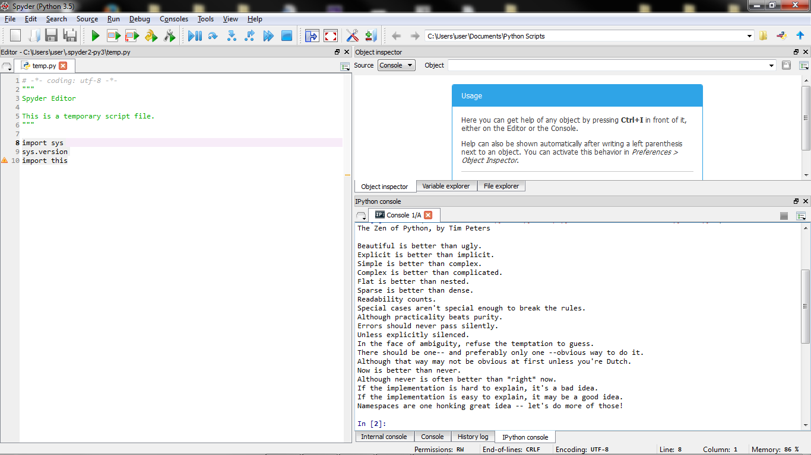

UECM3033 Assignment #1 Report
========================================================

- Prepared by: Chua Khang Hui
- Tutorial Group: T2

--------------------------------------------------------

## Task 1 -- setup a github repository

The reports, codes and supporting documents are uploaded to Github at: 

[https://github.com/ChuaKhangHui/UECM3033_assign1](https://github.com/ChuaKhangHui/UECM3033_assign1)

---------------------------------------------------------

## Task 2 -- setup python

Put here the screen shot of file (python.png)

------------------------------------------------------------

## Task 3 -- modify and run Python script

In this section, please report:

1. The hexadecimal value of your student ID.

The hexadecimal value converted from my student id, 1307304, will be 0x13f2a8

2. Write down the definite integrals that you have chosen.

The integrals i have chosen 
and the answer getting by numpy library is show below:

$$\int_0^{\infty} ln{(x)} e^{-x^2} dx = \frac{-\sqrt{\pi}\times ln{(2)}}{2} - \gamma \frac{\sqrt{\pi}}{4}.$$

where

$$ 
\gamma = \int_1^\infty (\frac{1}{\lfloor{x}\rfloor} - \frac{1}{x})dx\,.
$$

which is the EulerGramma or named Euler–Mascheroni constant that approximate to 0.57722

3. Write down your system of 10 linear equations.

The system of 10 linear equations i used in this assignment are

\begin{align*}
5 x_0 +1 x_1 +6 x_2 +5 x_3 +9 x_4 +1 x_5 +6 x_6 +3 x_7 +0 x_8 +6 x_9  &= 91,\\
9 x_0 +2 x_1 +7 x_2 +7 x_3 +8 x_4 +2 x_5 +4 x_6 +8 x_7 +4 x_8 +1 x_9  &= 71,\\
1 x_0 +2 x_1 +0 x_2 +4 x_3 +0 x_4 +3 x_5 +1 x_6 +1 x_7 +6 x_8 +8 x_9  &= 97,\\
0 x_0 +6 x_1 +3 x_2 +7 x_3 +8 x_4 +6 x_5 +8 x_6 +5 x_7 +9 x_8 +8 x_9  &= 87,\\
1 x_0 +3 x_1 +0 x_2 +3 x_3 +4 x_4 +2 x_5 +0 x_6 +5 x_7 +7 x_8 +3 x_9  &= 67,\\
7 x_0 +5 x_1 +4 x_2 +3 x_3 +3 x_4 +3 x_5 +0 x_6 +0 x_7 +3 x_8 +3 x_9  &= 35,\\
5 x_0 +1 x_1 +2 x_2 +2 x_3 +4 x_4 +5 x_5 +8 x_6 +9 x_7 +2 x_8 +2 x_9  &= 81,\\
7 x_0 +8 x_1 +0 x_2 +2 x_3 +2 x_4 +9 x_5 +8 x_6 +6 x_7 +2 x_8 +4 x_9  &= 19,\\
3 x_0 +7 x_1 +4 x_2 +8 x_3 +2 x_4 +3 x_5 +2 x_6 +0 x_7 +1 x_8 +6 x_9  &= 72,\\
3 x_0 +9 x_1 +1 x_2 +1 x_3 +4 x_4 +0 x_5 +6 x_6 +1 x_7 +6 x_8 +1 x_9  &= 13
\end{align*}

By solving this system using numpy library, i obtain the following solution:

\begin{align*}
&x_0 = -9.39124735,\  x_1 = 8.37149139, \ x_2 =29.57629687,\\
&x_3 =-17.39239156,\ x_4 =-13.06700154,\ x_5 = -11.13571917,\\  
&x_6 =-5.95958906,\ x_7 =23.02955185, \ x_8 =-0.62894768,\\  
&x_9=22.41608895
\end{align*}

-----------------------------------

last modified: 28/2/2016 02:40
